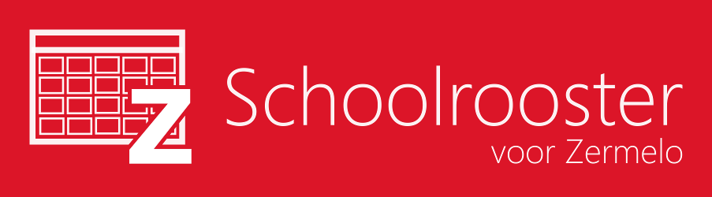

# Schoolrooster voor Zermelo

*Note: this is a third party initiative, it's not affiliated with Zermelo Software B.V. in any way.*

*Note: even though the default and only app language is Dutch, all the code, documentation, comments, this file, all issues etc. are in English. Reasons for this are my personal preference for thinking in English while coding, keeping in line with the [official documentation](https://zermelo.atlassian.net/wiki/spaces/DEV) by Zermelo Software B.V., and enabling non-Dutch speakers to understand everything happening here.*

*Schoolrooster voor Zermelo* is an app that allows students and teachers to check their schedules on all their Windows 10 devices. The app works with all schools and organizations that use the Zermelo portal technology to do their scheduling. The app is built on the Universal Windows Platform.

The backend for connecting to the Zermelo REST API that's used in this app is also available on GitHub: [Zermelo.API](https://github.com/arthurrump/Zermelo.API)

## How to contribute

All contributions are welcome! You can make a pull-request and write some code yourself, but please first open an issue detailing the things you want to change. It would be sad if you spend a lot of time building something that's completely beyond the scope of this project, or in a way that's completely different than the rest of the app. If you don't know how to write code, you can open issues too, if you think there's something that should be improved!

---
Licensed under the MIT License (see LICENSE file)